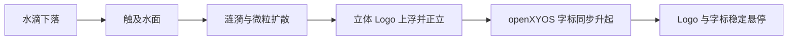
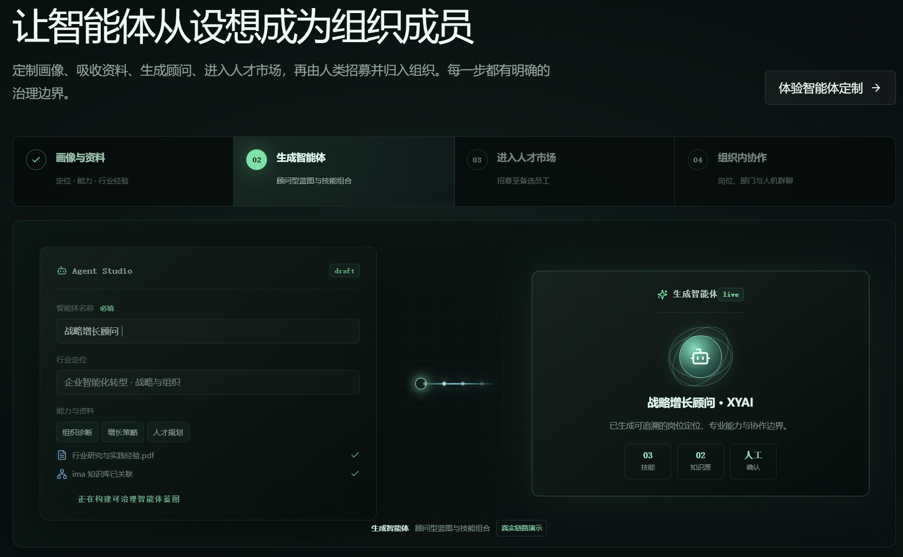
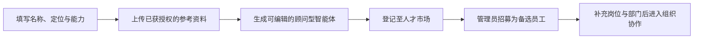

# openXYOS

**语言 / Languages:** [简体中文](README.md) · [English](README.en.md) · [安装指南语言索引](docs/i18n/README.md) · [本地化政策](docs/i18n/POLICY.md)

源码仓库：[github.com/XYAIStudio/openXYOS](https://github.com/XYAIStudio/openXYOS)

openXYOS 是从 XYOS 精简而来的开源人机组织操作系统。它保留集团多层级组织、多租户、模块化、人机共融共治、智能体定制、人机单聊群聊及可二次开发示例模块，面向开发者和社区共同演进。

<p align="center">
  
</p>


## 首页 Hero：为组织智能化管理而生

### 为人机共融组织而生的开源操作系统

openXYOS 将集团组织、多租户、模块化应用与可治理智能体放进同一套开放底座，让开发者共同构建真正可协作、可扩展、可审计的人机组织。

- **Apache-2.0**：可审阅、可协作的开源基础。
- **TypeScript 全栈**：前后端同语言，便于本地开发与二次扩展。
- **核心无私有依赖**：公开候选通过独立的源码边界检查。

### Hero 动画内容

首页 Hero 以“水滴落入水面”为开场：水滴触及水面后扩散出多层蓝色涟漪与微粒；注册 Logo 由水面升起、完成正立并面向观众；思源黑体 `openXYOS` 字标随后从水面升起并悬停于 Logo 上方。动画只承担品牌叙事，标题、按钮和安装终端始终处于最上层，且尊重浏览器的“减少动态效果”偏好。



```bash
npm ci
npm run dev
```

启动后打开 `http://localhost:5174`，即可查看完整交互式 Hero、水面动画与在线体验入口。动画实现位于 [`HeroWaterScene.tsx`](frontend/src/components/HeroWaterScene.tsx)，Logo 素材位于 [`xyos-water-logo.png`](frontend/public/assets/xyos-water-logo.png)。

## 智能体定制演示：让智能体从设想成为组织成员

首页的“让智能体从设想成为组织成员”区域提供了可交互的 Agent Studio 演示。它展示公开版的通用使用路径：填写画像与资料、生成顾问型智能体、进入人才市场，再由管理员招募并补充岗位与部门信息。演示中的资料、名称和数值均为示例，不应替代实际业务审批、数据授权或人工确认。

<p align="center">
  
</p>



在本地运行的首页中，可选择“体验智能体定制”切换演示步骤；进入系统后，在“智能体定制”和“人机资源”模块继续进行实际配置与招募。详细操作请阅读[中文操作指南](docs/guides/operation-guide.zh-CN.md#9-智能体定制)或[English operation guide](docs/guides/operation-guide.en.md#9-agent-studio)。

> 当前状态：社区发布候选版，适合本地开发、产品评估和协同完善；尚不宣称可直接用于生产。生产部署前仍需完成安全评审、持久化数据库、备份恢复和容量验证。

## 保留模块

系统登录后提供 12 个明确入口：工作台、通知公告、组织架构、人机资源、技能插件、沟通协作、智能体定制、任务管理、知识库、反思引擎、治理引擎、系统设置。

租户管理员可在“系统设置 → 模块管理”启停业务模块并编辑显示名称。工作台和系统设置是基础入口，不可关闭。前端侧边栏、路由守卫和后端租户配置使用同一份模块契约。

## 智能体定制链路

用户可以填写智能体名称、行业定位、能力和经验，上传 PDF、DOCX、TXT、Markdown、CSV 或 JSON 资料，并关联 ima 知识库地址。上传资料会经过安全检查和文本抽取，内容进入智能体蓝图及运行提示词。

生成后，顾问型智能体会自动进入人才市场；管理员招募后进入备选员工序列，再补充岗位职责和所属部门，即可进入组织。高风险结论默认要求人工复核，外发、删除、支付和生产修改默认禁用。ima 地址保存为“已关联、待运行验证”，不会伪报连接成功。

## 技术结构

```text
frontend/      React 19 + Vite + Zustand + TanStack Query
backend/       Express + WebSocket + SQL.js + 业务服务与路由
scripts/       集成测试、源码公开检查和依赖补丁
deploy/        社区容器运行参考；不代表生产部署认证
docs/          架构、模块二开契约、开源边界与质量门禁
```

更多信息见[多语言简介与安装指南](docs/i18n/README.md)、[中文操作指南](docs/guides/operation-guide.zh-CN.md)、[模块二次开发](docs/module-development.md)、[开源范围](docs/open-source-scope.md)、[架构概览](docs/architecture.md)和[首发开源发布闸门](docs/governance/OPEN_SOURCE_RELEASE_GATE.md)。

## 本地启动

要求 Node.js 20.19 或更高版本。

```bash
npm ci
cp .env.example .env
npm run dev
```

Windows PowerShell：`Copy-Item .env.example .env`，然后执行 `npm run dev`。首次启动前替换 `.env` 中的 `JWT_SECRET` 和 `COOKIE_SECRET`。前端地址为 `http://localhost:5174`，API 为 `http://localhost:3000/api`。

演示数据默认关闭。仅本地评估时设置 `SEED_DEMO_DATA=true`，并提供至少 12 位的自定义密码。项目不内置管理员密码。

## 验证

```bash
npm run lint
npm run typecheck
npm test
npm run verify:open-source
npm run build
```

`test:module-settings` 验证租户模块开关和改名；`test:agent-studio` 验证“资料上传 → 智能体生成 → 人才市场 → 备选员工”链路。

## 安全、贡献与许可证

请阅读 [社区指南](docs/community/README.md)、[SECURITY.md](SECURITY.md)、[CONTRIBUTING.md](CONTRIBUTING.md) 和 [CODE_OF_CONDUCT.md](CODE_OF_CONDUCT.md)。不要在公开 Issue 中提交漏洞细节、令牌、数据库或客户资料。使用问题请到 [Discussions Q&A](https://github.com/XYAIStudio/openXYOS/discussions/new?category=q-a)。

源代码按 [Apache License 2.0](LICENSE) 发布。openXYOS 源自 XYOS；品牌和标识规则见 [TRADEMARKS.md](TRADEMARKS.md)。贡献合并前须完成来源声明与贡献许可流程；首发治理资料见 [docs/governance](docs/governance)。
